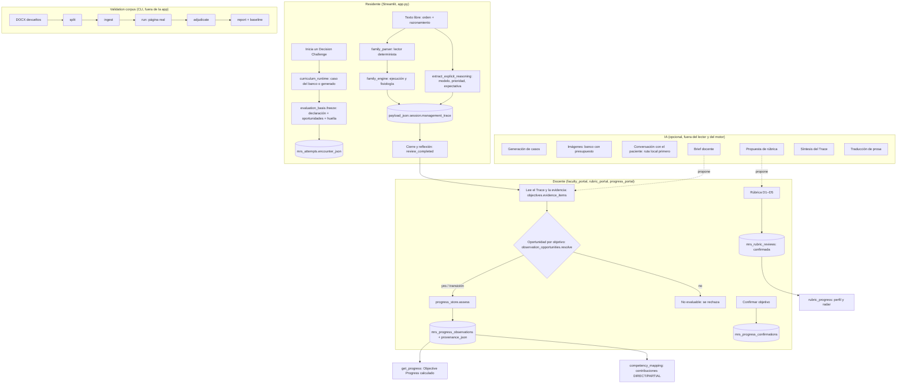
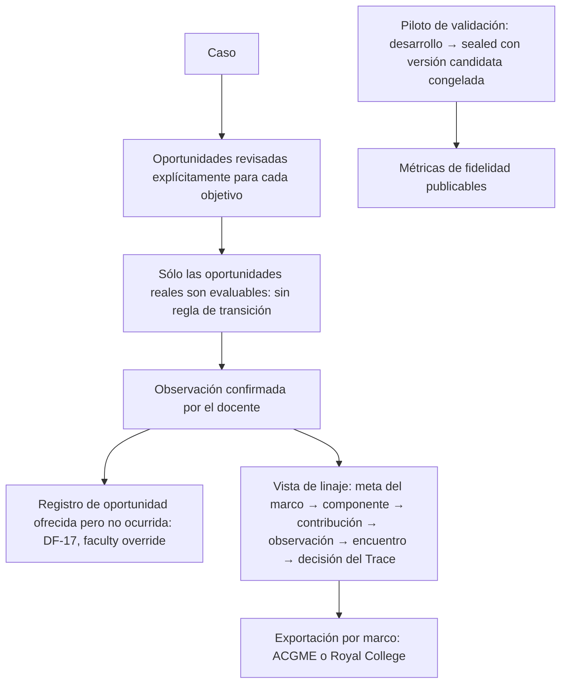

# Arquitectura: lo implementado y lo planificado

Ciclo 5 del AI Advisor (59BO), 2026-09-28.

**Dos diagramas separados a propósito:**

- **el primero es el código de `ec1c77f`** (la corrección nocturna 59Z no
  cambia la arquitectura);
- **el segundo es la dirección acordada, NO implementada.**

Una documentación futura no debería mezclarlos.

Los conceptos están en `DATA_DICTIONARY.md` y las fuentes de verdad en
`SOURCE_OF_TRUTH_MAP.md`.

## 1. IMPLEMENTADO (arquitectura real actual)

**Lo esencial:**

- **El lector y el motor son deterministas.** La IA propone; nunca registra
  evidencia.
- **Todo lo que un encuentro fue queda congelado** en `mrs_attempts`.
- **Lo que el docente decide vive en sus tablas.**
- **Progreso y perfil se recalculan al leer.**

## 2. PLANIFICADO (dirección acordada; NO implementado)

| Pieza planificada | Estado | Dónde está la decisión |
|---|---|---|
| Oportunidades revisadas para TD1, F1, C1, C3, C4 | **borrador** (ciclo 5, no escrito en el banco): 73 YES, 60 NO, 22 dudosas | DF-21 y `docs/tdfc/` |
| Retiro de la regla de transición | C14: 30 de 31 casos; los demás objetivos pendientes | DF-12 |
| *Faculty override* | **diferido** | DF-17 |
| Vista de linaje de evidencia | diseño; los datos actuales lo permiten en parte | `AUDITORIA_NOCTURNA_CICLO5.md`, anexo 59BF |
| Exportación por marco | no iniciada | `AUDITORIA_NOCTURNA_CICLO5.md`, anexo 59BG |
| Piloto de validación ejecutado | **listo, no enviado** | DF-15 |
